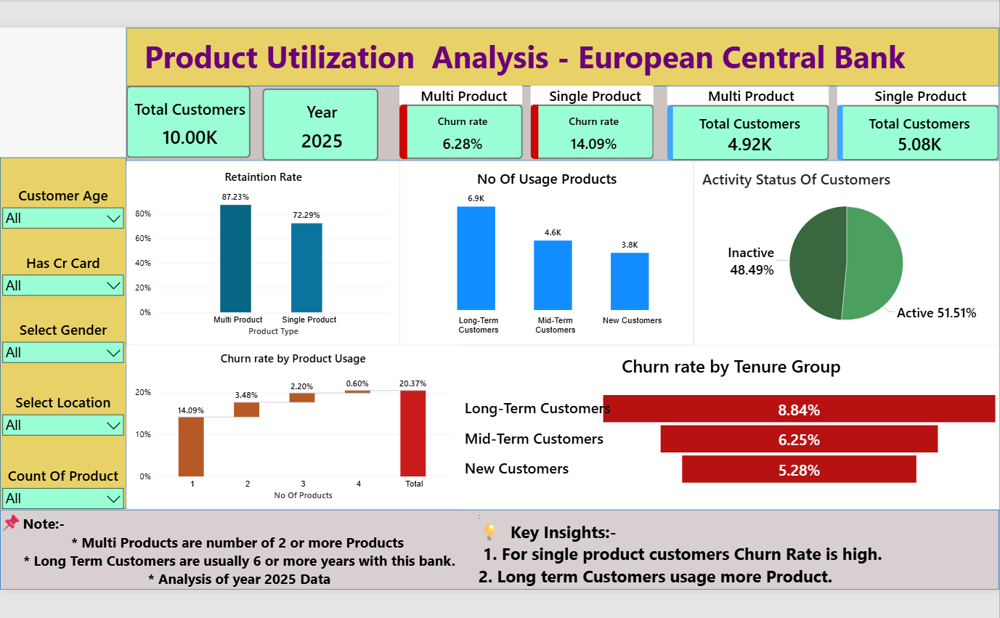
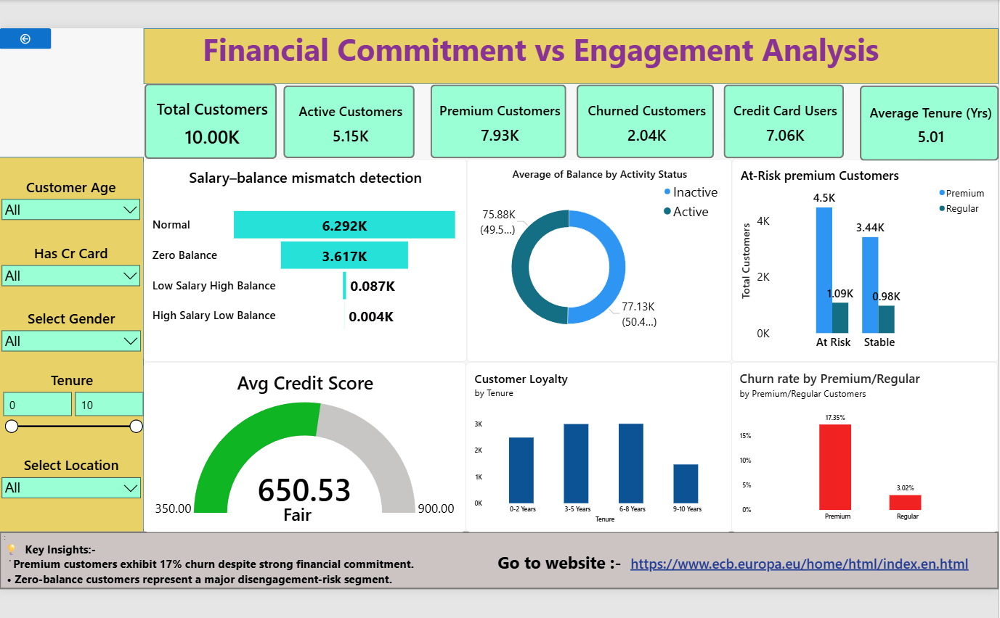
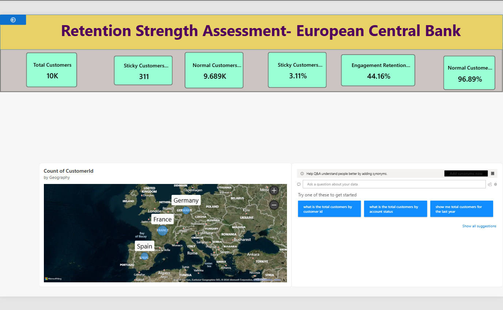
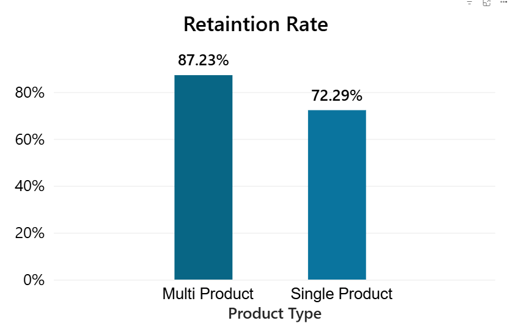
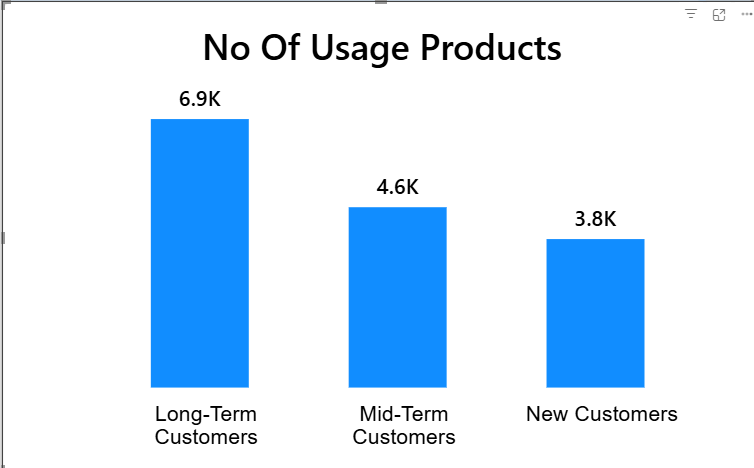
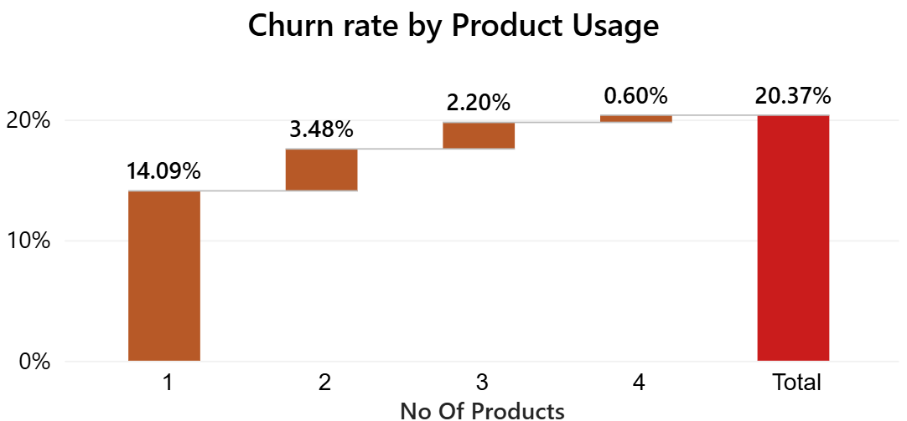
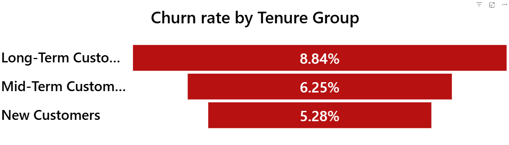

# Customer-Engagement-Product-Utilization-Analytics-for-Retention-Strategy - European-Central-Bank
This project analyzes European banking customer data to evaluate churn behavior, customer loyalty, engagement trends, and credit score distribution using interactive Power BI dashboards ,Streamlit live analytics and SQL-driven analytics on 2025 data.
This project evaluates retention through the lens of customer behavior and relationship strength.
# Background and Context
Banks increasingly recognize that customer behavior and engagement—not just demographics—determine long-term retention. Customers may appear financially strong (high balance or salary) but still churn due to:
* Low engagement
* Limited product adoption
* Weak relationship depth with the bank

  
Understanding how customers use banking products and services is essential to designing:
* Cross-sell strategies
* Loyalty programs
* Engagement-driven retention initiatives

# Project Objectives
  * Evaluate the relationship between engagement and churn
  * Measure retention impact of product count and product mix
  * Identify disengaged yet high-value customers

# Dataset Description
  
| Column|	Description|
|---|---|
|CustomerId|Unique customer identifier|
|Surname|	Customer surname|
|CreditScore	|Customer creditworthiness|
|Geography	|France, Spain, Germany|
|Gender	|Male / Female|
|Age	|Customer age|
|Tenure	|Years with the bank|
|Balance|	Account balance|
|NumOfProducts|	Number of bank products|
|HasCrCard|	Credit card ownership|
|IsActiveMember|	Activity indicator|
|EstimatedSalary|	Estimated annual salary|
|Exited|	Churn indicator (target)|
# Product Utilization  Analysis 
### Dashboard

  
  
  

For this analysis, an interactive dashboard was developed in Power BI that allows observation of the behavior of 10K banking customers in Europe. It has different slicers that allow the selection of specific characteristics for detailed analysis. Some measures were also created that complement the information provided by the dataset.

### Single-product vs multi-product retention
Retention rates among single-product customers are lower compared to multi-product customers, indicating stronger loyalty and engagement among customers using multiple banking services such as credit cards, loans, and insurance products. Long-term customers demonstrate higher product adoption and deeper banking relationships over time. Out of 10K total customers, 5.08K are single-product customers, while 4.92K are multi-product customers. The customer base consists of 5.46K male customers and 4.54K female customers.

France has the highest customer concentration with 5.01K customers, where single-product and multi-product customer distributions are nearly balanced, and male customers slightly outnumber female customers. Germany has 2.51K customers, with male customers representing a higher proportion than female customers. Spain has 2.48K customers, where male customers also slightly exceed female customers in distribution.

  
  

### Churn Rate 
Single-product customers exhibit significantly higher churn rates compared to multi-product customers, suggesting that customers with limited product engagement are more likely to leave the bank. In contrast, customers using multiple banking services such as credit cards, loans, and insurance products demonstrate stronger retention and long-term engagement.

Long-term customers also show higher churn levels than newer customers, indicating that extended tenure alone does not guarantee loyalty. This may result from changing financial needs, dissatisfaction with banking services, lack of personalized engagement, or competitive offers from other banks.

The overall churn rate is 20.37%, with female customers contributing 11.39% and male customers contributing 8.98%, indicating that female customers experience comparatively higher churn. This suggests potential differences in customer satisfaction, service expectations, or engagement patterns across gender segments.

  
  

# Skills and Tools
* Data analysis
* Critical thinking
* Dashboard creation
* Power BI

