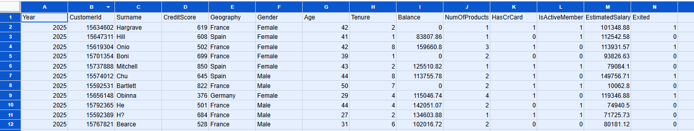

# Customer-Engagement-Product-Utilization-Analytics-for-Retention-Strategy - European-Central-Bank
This project analyzes European banking customer data to evaluate churn behavior, customer loyalty, engagement trends, and credit score distribution using interactive Power BI dashboards ,Streamlit live analytics and SQL-driven analytics on 2025 data.
This project evaluates retention through the lens of customer behavior and relationship strength.
# Background and Context
Banks increasingly recognize that customer behavior and engagement—not just demographics—determine long-term retention. Customers may appear financially strong (high balance or salary) but still churn due to:
* Low engagement
* Limited product adoption
* Weak relationship depth with the bank

  
Understanding how customers use banking products and services is essential to designing:
* Cross-sell strategies
* Loyalty programs
* Engagement-driven retention initiatives

# Project Objectives
  * Evaluate the relationship between engagement and churn
  * Measure retention impact of product count and product mix
  * Identify disengaged yet high-value customers

# Dataset Description
  
| Column|	Description|
|---|---|
|CustomerId|Unique customer identifier|
|Surname|	Customer surname|
|CreditScore	|Customer creditworthiness|
|Geography	|France, Spain, Germany|
|Gender	|Male / Female|
|Age	|Customer age|
|Tenure	|Years with the bank|
|Balance|	Account balance|
|NumOfProducts|	Number of bank products|
|HasCrCard|	Credit card ownership|
|IsActiveMember|	Activity indicator|
|EstimatedSalary|	Estimated annual salary|
|Exited|	Churn indicator (target)|
